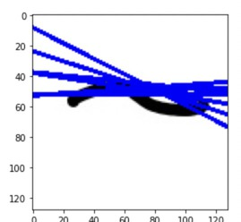

# Meowchine Learning
Training a math expression classifier and evaluator

Aniruddha Deb, Rishabh Dhiman, Aditya Singh

---------

## Introduction

Making a ML model at this scale is something we had never done before, and this
was both enjoyable as well as a great learning experience for us. 

We tried out multiple strategies and models to get the answer, before finally 
settling on the model that gave us the best results. Here's a small chart of
what we did and what clicked


## Prerequisites: Loading data, development enviroment

The environment we used throughout this process was Kaggle (with some final testing
done on Colab). The main reasons for using Kaggle were that Kaggle was a data first
platform (places more emphasis on data than models and notebooks, so managing 
and loading data was much easier). Kaggle also offers a 30hr/mo GPU limit (compared
to colab which has a 12h GPU limit), and it was also much easier to collaborate
with teammates on Kaggle. The dataset and our code will be made public once 
the hackathon results are out.

Some other prerequisites were loading data, making a dataloader, splitting into
test/train sets, all of which were accomplished by reading torch docs and 
StackOverflow snippets.

## Task 1

### Vanilla NN 3-Way classifier
This was the first and the most simple model that we hacked up. It had a 
3072->100->3 structure (3072 = 32\*96, we scaled our images down initially). 
We attained an accuracy of ~80% with this on the classification task

### CNN 3-Way classifier
The next thing we tried was using a CNN on the data. On using a CNN, our accuracy
jumped up to 95% with the scaled images. This was a great jump, but the model 
still had a lot of rough corners

## Intermission: switching to GPU

Kaggle requires phone verification for GPU usage, and offers 30 hours per user.
On verifying, we started converting our model to GPU, and after that, our model
was still not being fast enough. The reason was traced to scaling our images: 
scaling is done on the CPU and not the GPU, and the slow CPU was bottlenecking
the GPU. We then scaled all the images down, and uploaded a new version of the
dataset. The training was much faster after that.

## Task 2

### Vanilla NN
The first thing we tried was an extension of the vanilla NN, with a configuration
of 3072 -> 400 -> 91. (91 because outputs can range from -9 to 81). This performed
a little better than random, achieving a max accuracy of 13%. We had to change
our strategy, as this was hardly optimal.

### Hough Transform
The next suggestion was to use a Hough transform. This gave us some good results
for certain samples:

 

and not so good results for others

 

as a result, we didn't pursue this path further, due to the poor results and the
training complications that would originate

### Splitting the images and Training/Annotating

Finally, we came to the conclusion that it's hard to consider the image as a 
whole, and that we would have to split into multiple parts. This was not a 
surprising revelation, but we thought of using it as a last resort. The next
issue was finding the data to train a digit neural network, as the given 
dataset only had the final result of the expression. We then resorted to using 
the old version of the dataset: a generator algorithm was probably used to generate
the images for the old dataset, and the digits and operators were taken from 
another handwritten dataset. This claim is strong, because:

1. The initial dataset didn't have any shuffled images (all the images were in
   order: the first three were +00, 0+0, 00+ and the next three were -00, 0-0, 00-
   and so on.. the pattern had a period of 997 (the 997th image was the same 
   as the first).
2. A few samples had errors in them. In all these samples, it was the digit '0'
   that was to be expected in that position. This is because the original dataset
   had a blank in place of 0, and that error carried over to the generated dataset.

After multiple clarifications on whether using the old dataset was considered 
external, once we had confirmed it wasn't, we simply annotated it and used 
it to train our network

### Digit CNN network
This was very similar to the expression CNN, but on initially applying it to 
the scaled images, we were getting very poor accuracy. We then decided to apply
it to the unscaled images, and used larger size kernels and pooling domains to 
reduce the dimesionality by the time we reach the dense layers of the CNN. 

It worked!

We were getting accuracies we hadn't seen before; on the first run, the digit
recognizer got to ~99% in 5 epochs, and we were training it on only half of 
the dataset. After a broader and more extensive test, we concluded that this 
works great, and applied a similar network to Task 1's model. Similar results 
were obtained, with a 99.8% accuracy for task 1. Finally, our models had 
99.8% accuracy in task 1 and 98.5% accuracy in task 2 (overall this is ~ (0.996)^3)

Some further optimizations could have been done, but at this point we were 
<strike>too scared to change anything lest the model should break</strike> content
with the accuracy of the model and decided to freeze it in. 

## Wrapping up 

Once the models were made, we had to make the inference files. The inference files
contain a data loader and the model class. The weights and biases were exported
to files from the trained models, and those weight files were loaded into the 
model when it ran. A test run on 500 images on my machine worked fast enough, and
another test run on colab with CUDA verified that it was working well whether 
CUDA was absent or present. 

The inference files were completed by the night of 1st July, because Aniruddha 
had a debate on the 2nd and 3rd, and these writeups (as they are being written 
now) should be done by the night of 2nd July. 

## Dropping the curtain

This project wouldn't have been possible without the amazing team we had to back
it up: huge thanks to every single one of them (us? :P). Thank you to AIMLC for
organizing this hackathon, and putting our skills to the test and polishing them
as well. Finally, thanks to all the online resources we used, and to Kaggle and
Colab for hosting our data and running our programs without complaint, when we 
would reload the same model multiple times, hoping for the accuracy to change.

## Appendix: CNN topology

The CNN used was structured somewhat like this:

```
|   |   |   ||   | d |   |   ||   | d |   |   
|   |   |   ||   | r |   |   || d | r | d | o 
| c | p | R || c | o | p | R || e | o | e | u 
| o | o | e || o | p | o | e || n | p | n | t 
| n | o | L || n | o | o | L || s | o | s | p 
| v | l | U || v | u | l | U || e | u | e | u 
|   |   |   ||   | t |   |   ||   | t |   | t 
|   |   |   ||   |   |   |   ||   |   |   |   
```

Dropout layers are used to avoid overtraining, and they randomly zero out the 
outputs of the neurons of the previous layer. 
